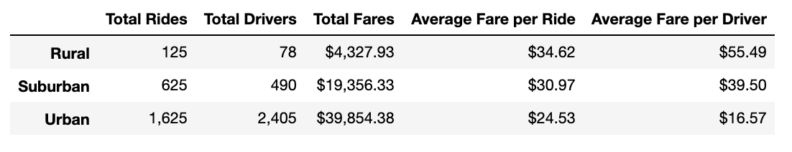
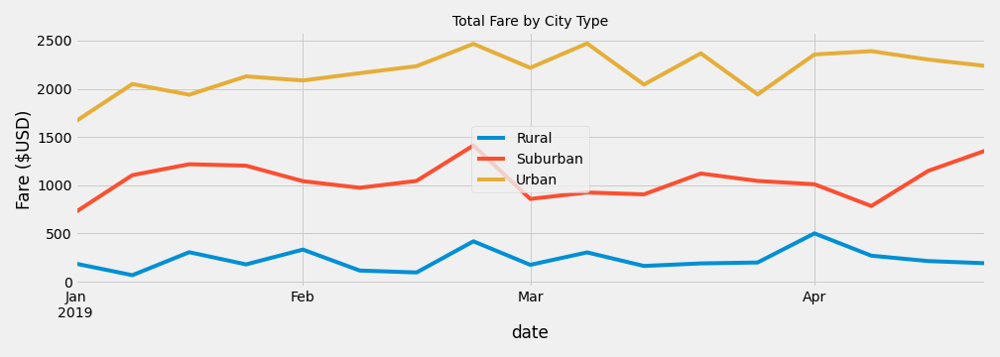

# PyBer Analysis

## Overview
We are looking for differences in fares by city types which are categorized as Urban, Suburban, and Rural form our ride sharing data. From our findings we will create a line chart using Pandas and Matplotlib that displays these trends and highlights differences.

## Analysis

From our analysis we can see there are some differences between each city type. Our Data frame shows a breakdown of each city type and their Total Rides, Total Drivers, Total Fares, Average Fare per Rider, and Average Fare per Driver based on the data we received. From a glance, we can see that there are more rides and drivers in Urban cities which results in the most revenue (total fares). However it is interesting to see in the Rural cities, the Average Fare per Ride and Average Fare per Driver are $10 to $20 more than the Urban cities.
We can also see there are more drivers than riders in Urban cities, resulting in the Average Fare per Driver to be lower than the Average Fare per Ride. Alternatively we see that Suburban and Rural cities have more riders than drivers, which results in higher fares for drivers. 

Our line plot shows Urban cities with the highest revenue each week. There are some dips which may correlate with bad weather or behavior. The Suburban cities remain relatively consistent around the $1,000 mark and the Rural cities generate the least amount of revenue.

## Summary
- There are more rides happening in Urban areas but they are cheaper. We can encourage more riders in these areas to travel longer distances.
- There may be a shortage of drivers in. rural and suburban areas, we can encourage drivers in Urban cities to move to these areas with bonuses.
- Get more drivers in suburban areas to use Pyber on the weekday if they are going into Urban areas for work with promotions.
